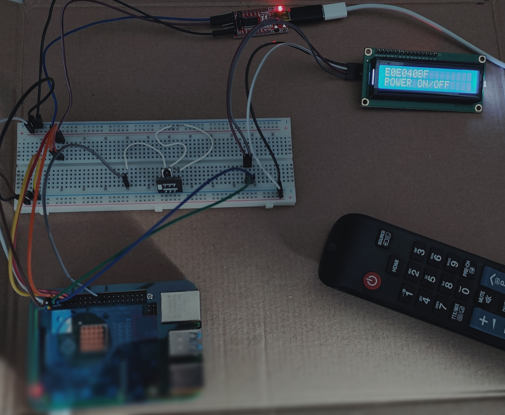
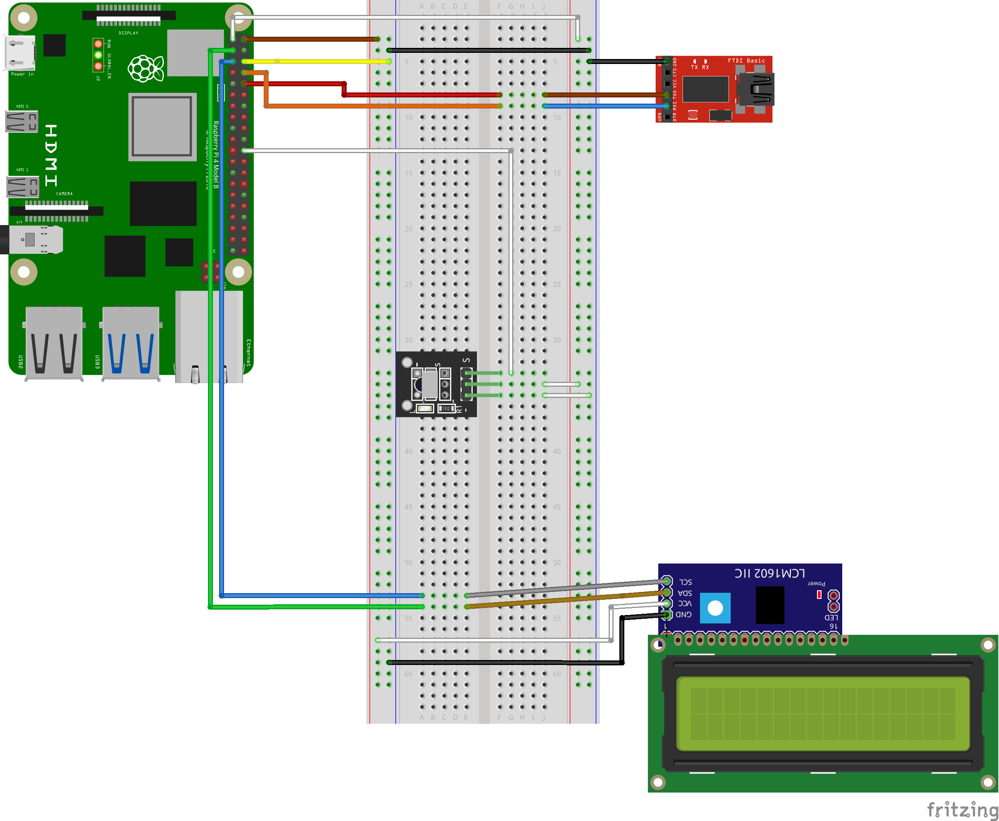

# IR Receiver Project on bare-metal Raspberry Pi 4 Model B

The proposed project consists of using an IR receiver to capture commands sent by a remote controller and displaying them on an LCD display, along with the name of the pressed buttons.

<div align="center">
    
</div>

## Connections
<div align="center">
    
</div>

<div align="center">

| Pi 4 Model B  |  KY-022 | FT232RL | IIC PCF8574T |
| :-----------: | :-----: | :-----: | :----------: |
| GPIO 25       |    S    |         |              |
| 3V3 power     |    +    |         |              |
| GPIO 14 (TXD) |         |    RX   |              |
| GPIO 15 (RXD) |         |    TX   |              |
| 5V power      |         |         |      VCC     |
| GPIO 2 (SDA)  |         |         |      SDA     |
| GPIO 3 (SCL)  |         |         |      SCL     |
| Ground        |    -    |   GND   |      GND     |

</div>

---
> **IMPORTANT**: A complete overview of the project, including the necessary hardware, is available in [documentation.pdf](docs/documentation.pdf). You should read it **before** running the project.
---

## Prerequisites

Your micro SD card must contain the following files:
- `bootcode.bin`;
- `config.txt`;
- `fixup.dat`;
- `start4.elf`;
- `kernel7.img` (which contains `pijFORTHos`);
- `bcm2711-rpi-4-b.dtb`.

And the `config.txt` file must contain the following uncommented options:

```
dtparam=i2c_arm=on
enable_uart=1
```
which enable the IIC and the UART, respectively.

## Code structure
- `jonesforth.f`
: This file contains the word definitions needed for creating strings in memory;
- `se-ans.f`
: This file contains some word definitions for ANSI compliance, created by Professor Daniele Peri;
- `utils.f`
: This file contains general words used throughout the project to manage the reading and, possibly, writing of GPIO pin levels;
- `timer.f`
: This file contains word definitions for reading values from the Raspberry Pi 4 Model B System Timer counter;
- `i2c.f`
: This file contains word definitions to handle the IIC communication with the LCD display;
- `lcd.f`
: This file contains word definitions to print hexadecimal numbers and strings on the LCD, as well as common control commands to clear the display and move the cursor;
- `ir_receiver.f`
: This file contains word definitions that implement the protocol explained in the previous sections to capture commands sent from the remote controller to the IR receiver;

- `lookup_table.f`
: This file contains a simple mapping from the hexadecimal commands sampled by the IR receiver to the corresponding string printed on the pressed buttons;
- `main.f`
: This file contains the main program to be run at startup.

## How to run

To run the project, download the repository using
```
git clone https://github.com/FarInHeight/Embedded-Systems-Project.git
```

First, using Pi 4, verify the LCD IIC slave address using:
```
sudo apt-get install i2c-tools
i2cdetect -y 1
```

and change the slave address in `INIT_I2C` (contained in `i2c.f`) accordingly.
If you are using a Pi 3 Model B or Model B+, change the constant `PERI_BASE` in `utils.f` to `0x3F000000`[^pi3].

After that, download `picocom` and `minicom`, load `pijFORTHos` into the micro SD card and change the shell `#!/bin/zsh` to your shell (also change the python interpreter if needed).

Change the execution permissions as
```
chmod u+x unify_and_uncomment.py
chmod u+x create_program.sh
```
and run the script `./create_program.sh`.

Finally:
- connect the Pi and the serial UART to your terminal;
- run ``` picocom --b 115200 <your UART> --send "ascii-xfr -sv -l100 -c10" --imap delbs ```;
- press <kbd>Ctrl</kbd> + <kbd>A</kbd> and <kbd>Ctrl</kbd> + <kbd>S</kbd>;
- load the file `program.f` generated by `./create_program.sh`;
- start the program by typing `MAIN` and pressing <kbd>Enter</kbd>.

At this point you can disconnect the UART and enjoy the project.

## License
[MIT License](LICENSE)

[^pi3]: For the project to work, the boot files must also be changed